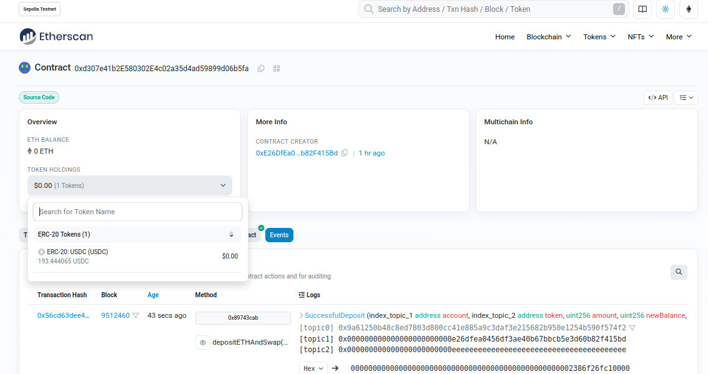

# KipuBankV3

A decentralized bank smart contract that stores all deposits as USDC and integrates with Uniswap for seamless token swaps.

## 🚀 New Features

### USDC-Only Storage Architecture
- All deposits are automatically converted to USDC (6 decimals)
- Single-token accounting simplifies balance tracking
- Reduced gas costs and complexity

### Uniswap Integration
- **Deposit any token**: ETH, LINK, or any ERC20 → automatically swapped to USDC
- **Withdraw to any token**: USDC → swapped to your desired token (ETH, LINK, etc.)
- Powered by Uniswap Universal Router for best swap rates


## 📝 Contract Details



**Deployed on:** Sepolia Testnet  
**Address:** `0xd307e41b2E580302E4c02a35d4ad59899d06b5fa`  
**Verified:** ✅ [View on Etherscan](https://sepolia.etherscan.io/address/0xd307e41b2e580302e4c02a35d4ad59899d06b5fa)

**Configuration:**
- USDC: `0x1c7D4B196Cb0C7B01d743Fbc6116a902379C7238`
- Universal Router: `0x3A9D48AB9751398BbFa63ad67599Bb04e4BdF98b`
- Bank Capacity: 10,000 USDC

## 🔧 Core Functions

### Deposits
```solidity
// Direct USDC deposit
depositToken(address token, uint256 amount)

// Deposit ETH and swap to USDC
depositETHAndSwap(bytes commands, bytes[] inputs, uint256 minUsdcOut, uint256 deadline)

// Deposit any ERC20 and swap to USDC
depositTokenAndSwap(address token, uint256 amount, bytes commands, bytes[] inputs, uint256 minUsdcOut, uint256 deadline)
```

### Withdrawals
```solidity
// Direct USDC withdrawal
withdrawToken(address token, uint256 amount)

// Withdraw USDC and swap to any token
withdrawAndSwap(uint256 usdcAmount, address targetToken, bytes commands, bytes[] inputs, uint256 minTokenOut, uint256 deadline)
```

### View Functions
```solidity
// Get user's USDC balance (owner/admin only)
getBalanceOf(address token, address account)

// Get total bank value in USD (8 decimals)
totalBankUsd()
```


## 🧪 Testing with foundry

📋 **[View Complete Test Results](./TESTS_SUMMARY.md)**

Run the test suite:
```bash
# Deposit tests
forge script script/tests/TestDepositETHToUSDC.s.sol --rpc-url sepolia --broadcast
forge script script/tests/TestDepositLINKToUSDC.s.sol --rpc-url sepolia --broadcast
forge script script/tests/TestDirectDepositUSDC.s.sol --rpc-url sepolia --broadcast

# Withdrawal tests
forge script script/tests/TestDirectWithdrawUSDC.s.sol --rpc-url sepolia --broadcast
forge script script/tests/TestWithdrawUSDCToLINK.s.sol --rpc-url sepolia --broadcast
forge script script/tests/TestWithdrawUSDCToETH.s.sol --rpc-url sepolia --broadcast

# Security tests
forge script script/tests/TestUnauthorizedWithdraw.s.sol --rpc-url sepolia --broadcast
```
